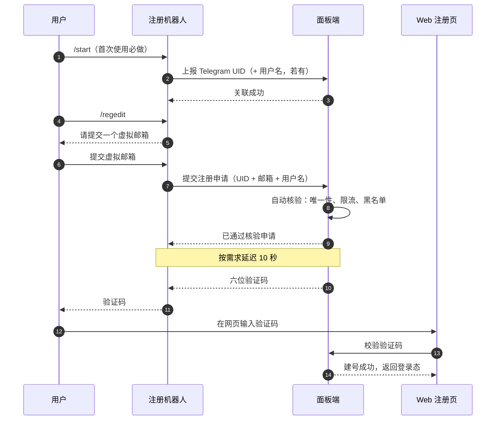

# Telegram 注册体系改造 · 开发需求

> v0.1 草案 · 2026-09-28 · 状态：待确认（8 项决策见第 7 节）
>
> 本文是需求与设计草案，**尚未产生任何代码改动**。文中标注「已核实」的事实来自通读仓库代码；标注「待确认」的是原始表述里存在歧义、无法从代码推断的部分。

## 0. 一句话

把注册、登录、找回密码、购买、查询、娱乐收敛到同一个 Telegram 机器人上；邮箱退化为用户自填的虚拟标识符，邮件通道整体下线。

---

## 1. 目标与边界

**范围内**：移除邮箱注册与邮件验证码、移除 Google / GitHub OAuth、注册与找回密码改由机器人下发验证码、机器人内完成购买与查询、通知收口到机器人。

**范围外（明确保留）**：Telegram OAuth 登录（Login Widget）、**管理员后台的邮箱 + 密码 + 二步验证登录**、订阅下发与节点侧接口、支付通道本身。

> 管理员后台登录必须排除在外：一旦 Telegram 侧故障，运维就再也进不了面板。这一点需要明确确认（见 D1）。

---

## 2. 现状盘点（影响面）

| 面 | 现有实现 | 处置 |
|---|---|---|
| 邮箱注册 | `AuthController::register` + `AuthRegister`（`required\|email:strict`） | 移除 |
| 邮件验证码 | `Passport/CommController::sendEmailVerify`、缓存键 `EMAIL_VERIFY_CODE`、`SendEmailJob` | 移除 |
| 邮箱找回密码 | `AuthController::forget` + `AuthForget` | 移除 |
| Google / GitHub OAuth | `OAuthService`、`v2_oauth_identity`、后台 `oauth_google_*` / `oauth_github_*` | 移除 |
| Telegram OAuth 登录 | `OAuthController` + Login Widget（HMAC 校验，占位邮箱 `telegram_<uid>@telegram.invalid`） | 保留 |
| 管理员后台登录 | 邮箱 + 密码 + 二步验证（`adminLogin` / `verify2fa`） | 保留 |
| 机器人本体 | 单 token、单 webhook（`/api/v1/guest/telegram/webhook`）、插件式命令 11 个 | 保留并扩展 |
| 一次性登录链接 | `TelegramLoginLinkService`：64 位十六进制票据、60 秒 TTL、15 秒冷却、落库 `v2_telegram_login_link` | 复用为 `/login` |
| 账号 ↔ Telegram 绑定 | `v2_user.telegram_id`，**无唯一索引**，仅靠代码校验 | 改为注册前置 |
| 娱乐玩法 | `TelegramRewardService`（骰子 / 老虎机 / 签到 / 奖励），与主机器人共用同一 token | 并入 |
| 流量与订阅查询 | `Traffic.php`、`GetLatestUrl.php` 命令 | 并入 `/get_traffic` |
| 订单与支付 | `/user/order/save` → `/checkout` → 支付通道，回调走 `/guest/payment/notify` | 新增机器人入口 |
| 重置流量 | 套餐 `reset_price` + 下单 `period=reset_price` | 暴露为 `/reset` |
| 通知 | `sendMessageWithAdmin($msg, $isStaff)`：订单、工单、服务器告警共用 | 收口鉴权 |

### 已核实的两个技术前提

1. **`v2_user.telegram_id` 没有唯一索引。** 「一个 Telegram 只能对一个账号」目前完全靠应用层判断（机器人 `/bind` 判一次，账号绑定服务判一次）。注册路径被并发刷时会漏，必须在建号前补上唯一约束或行锁。
2. **`email` 列是 `NOT NULL` + `UNIQUE`。** 虚拟邮箱只能沿用现有占位写法；把列改成可空会波及登录、找回、OAuth 合并、后台检索等十几处，不建议。

---

## 3. 注册链路

1. **前置绑定**：用户在机器人里 `/start` 时，面板记录 Telegram UID 与用户名，写入注册申请上下文（此时还没有账号）。
2. **双绑定**：`/regedit` 提交虚拟邮箱后，申请记录同时持有 UID 与邮箱；两者在建号时一起落库，邮箱成为登录标识，UID 成为身份凭据。
3. **自动核验**：面板侧自动完成唯一性（邮箱未占用、UID 未占用）、限流（IP / UID 维度）、黑名单与开关检查。此步不引入人工审核。
4. **验证码**：核验通过后下发六位随机字符，绑定到该申请记录，一次性消费。
5. **Web 落号**：网页提交验证码 → 面板校验 → 建立账号、写入 `telegram_id`、签发登录态。

---

## 4. 需求详述

### 4.1 登录方式（收敛为三条）

| 方式 | 凭据 | 状态 |
|---|---|---|
| Telegram OAuth | Login Widget 签名数据（HMAC） | 现有，保留 |
| 机器人验证码 | 六位随机字符 | 新增 |
| 一次性链接 | 机器人 `/login` 生成的临时网址，点击即作废 | 复用现有服务 |
| ~~邮箱 + 密码~~ | — | 移除 |

### 4.2 忘记密码

用户在机器人侧发起找回 → 面板校验该 UID 已绑定账号 → 下发六位验证码 → 用户在网页提交验证码与新密码。校验失败按 IP 与申请双维度计数锁定，重置成功后清空全部会话。

### 4.3 命令全集

| 命令 | 职责 | 实现来源 |
|---|---|---|
| `/start` | 开启机器人，完成 Telegram UID 首次关联 | 改造现有 Start（目前指向娱乐菜单） |
| `/regedit` | 注册流程：提交虚拟邮箱 → 自动核验 → 收验证码 | 新增 |
| `/login` | 生成一次性免登录网址，点击后作废 | 复用 `TelegramLoginLinkService` |
| `/get_subscription` | 拉取后台在售套餐，直接下单并走支付通道 | 新增，复用 `order/save` + `checkout` |
| `/get_traffic` | 返回订阅与流量信息 | 合并 `Traffic` + `GetLatestUrl` |
| `/reset` | 按套餐重置包价格重置流量；未配置重置包则提示不支持 | 新增，复用 `period=reset_price` |
| `/bind` `/unbind` | 订阅与售后群绑定 / 解绑 | 保留 |
| `/checkin` `/dice` `/slots` `/reward` | 娱乐玩法 | 并入，运算逻辑不动 |
| `/reply` | 工单回复 | 保留 |

### 4.4 机器人内购买

可行，但形态受限。现有支付驱动产出的是跳转网址或二维码页，机器人能做的稳妥形态是：`/get_subscription` 列出套餐 → 选中后建单 → 机器人回一条带支付按钮的消息（按钮指向支付网址或二维码页）→ 回调到账后由面板推送开通通知。

> **待确认 D5**：真正「在对话内完成支付」需要 Telegram Payments（要求支付服务商支持、机器人开通），与现有支付通道是两套东西。

### 4.5 通知与鉴权

订单收入与工单通知已由 `sendMessageWithAdmin` 发送，它按 `is_admin`（可选 `is_staff`）筛选收件人，且只发给已绑定 `telegram_id` 的管理员——与「只有管理员才收到」的要求一致。需要做的是把调用点收口并补上显式鉴权，而不是新造通知通道。

### 4.6 娱乐并入

仓库里只有一套机器人（单 token、单 webhook），娱乐命令是插件目录下的普通命令，与注册命令同宿。若线上说的「专属娱乐机器人」是另一次独立部署，需要说明它的对外接口面，才能判断是合并还是并存。

---

## 5. 数据与接口

### 5.1 数据结构

| 对象 | 变更 | 说明 |
|---|---|---|
| `v2_user.telegram_id` | 加唯一索引 | 可空唯一列，存量 NULL 不受影响；并发注册的兜底 |
| `v2_user.email` | 不改结构 | 继续承载虚拟邮箱；放宽校验规则（见 D3） |
| 注册申请 | 新增 | 持有 UID、用户名、虚拟邮箱、验证码、状态、时间戳；可落库或复用缓存票据 |
| `v2_oauth_identity` | 停用 | google / github 记录保留但不再产生；telegram 记录继续使用 |
| 缓存键 | 新增 | 验证码、申请上下文、限流计数；键名需登记进白名单表 |

### 5.2 接口

| 接口 | 用途 |
|---|---|
| `POST /passport/auth/register/telegram` | 校验验证码并建号，返回登录态 |
| `POST /passport/auth/forget/telegram` | 校验验证码并重置密码 |
| `POST /passport/auth/login/telegram-code` | 验证码登录 |
| `POST /passport/comm/sendTelegramCode` | 站点侧请求下发验证码 |
| `GET /guest/comm/config` | 增加注册方式标志位，供前端决定入口形态 |

### 5.3 配置项

| 配置 | 动作 |
|---|---|
| `email_verify` · `email_whitelist_*` · `email_gmail_limit_enable` | 移除 |
| `oauth_google_*` · `oauth_github_*` | 移除 |
| `oauth_telegram_*` | 保留 |
| `telegram_bot_token` · `telegram_webhook_secret` | 保留（是否独立机器人见 D6） |
| 注册开关 · 验证码时效 · 限流阈值 · 审核延迟 | 新增 |

---

## 6. 安全要求

验证码与邮箱验证码有本质差别：邮件码证明「你能收到发往某个邮箱的信」，邮箱本身是身份锚点；机器人验证码**本身就是身份锚点**——拿到码就能拿到那个 Telegram 身份对应的账号。以下为硬性要求：

| 要求 | 取值建议 |
|---|---|
| 一次性消费 | 校验通过即销毁，重放无效 |
| 时效 | 5 分钟，超时作废 |
| 尝试上限 | 按 IP 与按申请双维度计数，连续失败锁定 |
| 下发节流 | 同一申请 60 秒内不可重发，单 IP 每分钟上限 |
| 不可枚举 | 校验失败的响应不得区分「码不存在」与「码不匹配」 |
| 绑定不可复用 | 同一 Telegram UID 不得建第二个账号，由唯一索引兜底 |
| 建号即失效 | 建号成功即刻作废申请上下文与验证码 |

> 六位数字空间仅百万级。由于验证码在 Telegram 里下发，用户可以一点即复制，不必为了好记牺牲强度。若坚持六位，上述限流必须一项不落。

---

## 7. 待确认决策

**D1 · 存量邮箱账号如何进入？**
站内已有大量「邮箱 + 密码」账号，移除邮箱登录后他们无法登录。可选：保留邮箱登录作为遗留通道（不新增注册）／首次登录引导绑定 Telegram 后停用邮箱登录／强制人工迁移。同时确认：管理员后台的邮箱 + 密码 + 二步验证登录**保留不动**。

**D2 · 30 秒核验与 10 秒延迟发码，是刻意设计还是表述？**
技术上用延迟队列完全可做，但会显著拉长注册转化路径，且用户中途关掉机器人就断了。建议：即时自动核验（把「30 秒内」理解为**不超过** 30 秒的上限），延迟只作为文案节奏，或做成后台可配项。

**D3 · 虚拟邮箱的规则**
是否校验格式？允许任意字符串则无法复用现有 `email:strict` 校验，需新规则。是否全局唯一？是否允许用户后续更换？是否作为客服识别与工单标识？

**D4 · 注册入口在 Web 端如何收口**
已核实：三套主题产物里**只有 ez** 引用了「仅第三方注册」开关，default 与 signature 完全没引用——靠开开关藏不掉邮箱注册表单。可选：改主题产物／用独立脚本注入 CSS 隐藏／服务端直接拒绝提交（表单仍在，提交报错）。

**D5 · 「机器人内支付」的真实形态**
方案 A：机器人发支付链接／二维码，用户在站外完成支付（改动最小，兼容现有全部支付通道）。方案 B：接入 Telegram Payments，在对话内完成（需支付服务商支持与机器人开通）。

**D6 · 注册机器人复用现有机器人还是独立一套？**
本仓库现状：单 token、单 webhook，娱乐命令同宿。若另起一个 bot，需要独立 token、独立 webhook、独立配置项。同时说明「专属娱乐机器人作废」指的是哪一套部署——代码里没有第二套机器人。

**D7 · 存量数据怎么处理**
`v2_oauth_identity` 里的 google / github 记录：保留归档还是一并清理？存量真实邮箱：保留原值，还是统一改写为虚拟邮箱？

**D8 · 机器人不可用时的兜底**
Telegram 故障、token 失效、webhook 掉线时，注册与登录会全停。是接受单点，还是保留一条人工或邮箱应急通道？

---

## 8. 风险

| 风险 | 影响 | 缓解 |
|---|---|---|
| 单点依赖 | 机器人故障即注册登录全停 | 保留应急通道（D8） |
| 存量用户流失 | 老用户不会用机器人 → 直接流失 | 迁移引导 + 过渡期双轨（D1） |
| 邮件能力缺失 | 虚拟邮箱收不到通知、账单、工单邮件 | 改为站内信 / 机器人推送，或补邮箱入口 |
| 身份重复 | 同一人既有邮箱账号又注册 Telegram 账号 | UID 唯一约束 + 合并流程（需单独设计） |
| 验证码被枚举 | 他人身份被抢注 | 第 6 节全部限流项 |
| 前端收口不彻底 | 邮箱注册表单仍在，用户可提交 | 服务端拒绝 + 前端隐藏（D4） |

---

## 9. 工作拆分

| 阶段 | 内容 | 前置 |
|---|---|---|
| 一 | 数据层：`telegram_id` 唯一索引、申请与验证码存储、缓存键登记、限流 | D3 |
| 二 | 机器人命令 `/start` 改造、`/regedit`、`/login`；面板侧核验与建号接口；Web 端验证码入口 | D1 D2 D3 |
| 三 | 找回密码、验证码登录；移除邮箱注册与邮件验证码、移除 Google / GitHub OAuth；前端收口 | D1 D4 D7 |
| 四 | 机器人内购买与查询（`/get_subscription`、`/get_traffic`、`/reset`）、通知收口、娱乐并入 | D5 D6 |

前两阶段完成即可跑通「注册—登录—找回」闭环，后两阶段是功能扩展。
